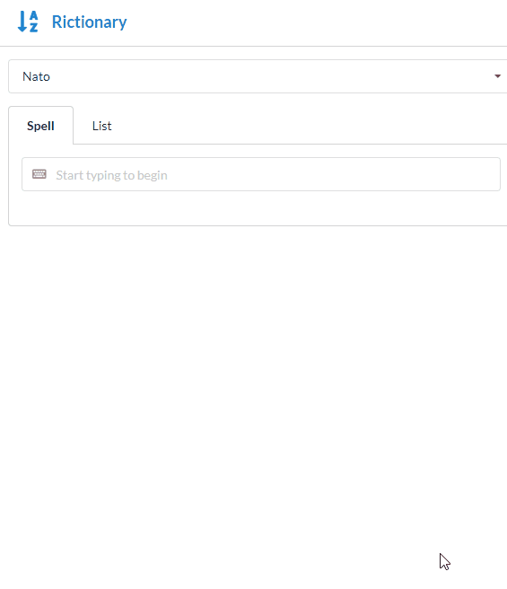
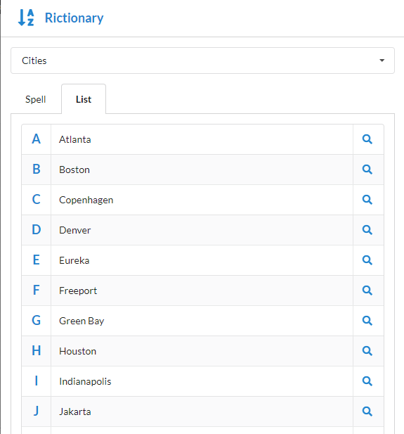

# Rictionary

Rictionary is a tool to help you spell out words and phrases over the phone or aloud so the other person can better understand you.

## Inspiration

I once overheard a coworker giving instructions for resetting their password over the phone. The coworker tried to spell it out using what I thought were confusing words like "L as in 'Lollipop'" and "C as in 'Chair'". I thought to myself, "There must be a better way."

## Examples

### Spelling a word
As you type, the selected Rictionary will be used to spell out the given phrase.

### Listing all Rictionary words

You can view all the words in a given Rictionary at once on the List tab. Each entry also contains a link to search the value on Google, in case you're not already familiar with the term.

